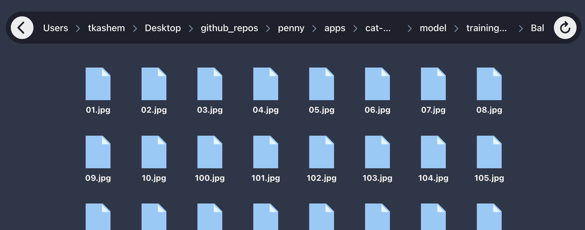

<h1 align="center">
  
  Image Classification Dataset Prepper
</h1>

https://user-images.githubusercontent.com/1139927/209483361-07815ebc-6448-47b3-9482-991f43574b90.mp4

<br />

<p>When preparing datasets for training image classification models it's a real pain to manually sift through thousands of images to weed out the inaccurate, duplicate and broken ones. This cross-platform app aims to make the process a little more tolerable by allowing you to use keyboard shortcuts to quickly cycle through all the images in a folder and delete the ones you don't want.</p>

## Installation

First install the dependencies:

```
> yarn install or npm install
```

then build the executable:

```
> yarn package or npm run package
```

The resultant launch file can be found in the `release/build/*` folder e.g. on a mac it's `release/build/mac/ImageReviewer.app`. You can move this anywhere like to your desktop and run it as a standalone app going forward.

## Development

```
> yarn start or npm start
```

This will spin up a dev server which auto-reloads on file changes.

## Files

- Electron backend - `src/main/*`
- React frontend - `src/renderer/*`

## Usage

- <kbd>→</kbd> - next image
- <kbd>←</kbd> - prev image
- <kbd>Space</kbd> - delete image
- <kbd>CMD</kbd> / <kbd>CTRL</kbd> + <kbd>Z</kbd> - undo delete
- <kbd>CMD</kbd> / <kbd>CTRL</kbd> + <kbd>R</kbd> - refresh the app
- click the "&#x21bb;" icon on the top right of the screen to reset history (visited folders appear at a lower opacity for tracking purposes)
- &#9835; pop noise sounds each time a full loop completes when cycling through a directory

## Folder structure


1. Click the first button if your folder structure looks like this:

```
dog-images/
- doberman/
  - a.jpg
  - b.png
- german-shepherd/
  - c.jpg
  - d.webp
- minature-poodle/
  - e.png
  - f.jpg
- etc..
```

In other words if you have a root folder with subfolders for each _class_, and inside those folders are your images.

2. Click the second button if you just want to browse a single folder full of images

## Limitations

This app assumes that the selected folder contains either only images or only sub-folders. It's not a full fledged file explorer and can't handle anything else at the moment.

If you ever see anything like the following it means that you clicked on the wrong button:



Refresh the app (CMD/CTRL + R) and try selecting the same folder but with the blue button.

## Roadmap

- Automate deleting duplicate images
- Automate deleting broken images

## Credits

- [IOS Camera Icon](https://iconscout.com/icon/photos-30) by Giulio Smedile
- [Electron React Boilterplate](https://github.com/electron-react-boilerplate/electron-react-boilerplate)
- [Chakra UI component library](https://github.com/chakra-ui/chakra-ui)
