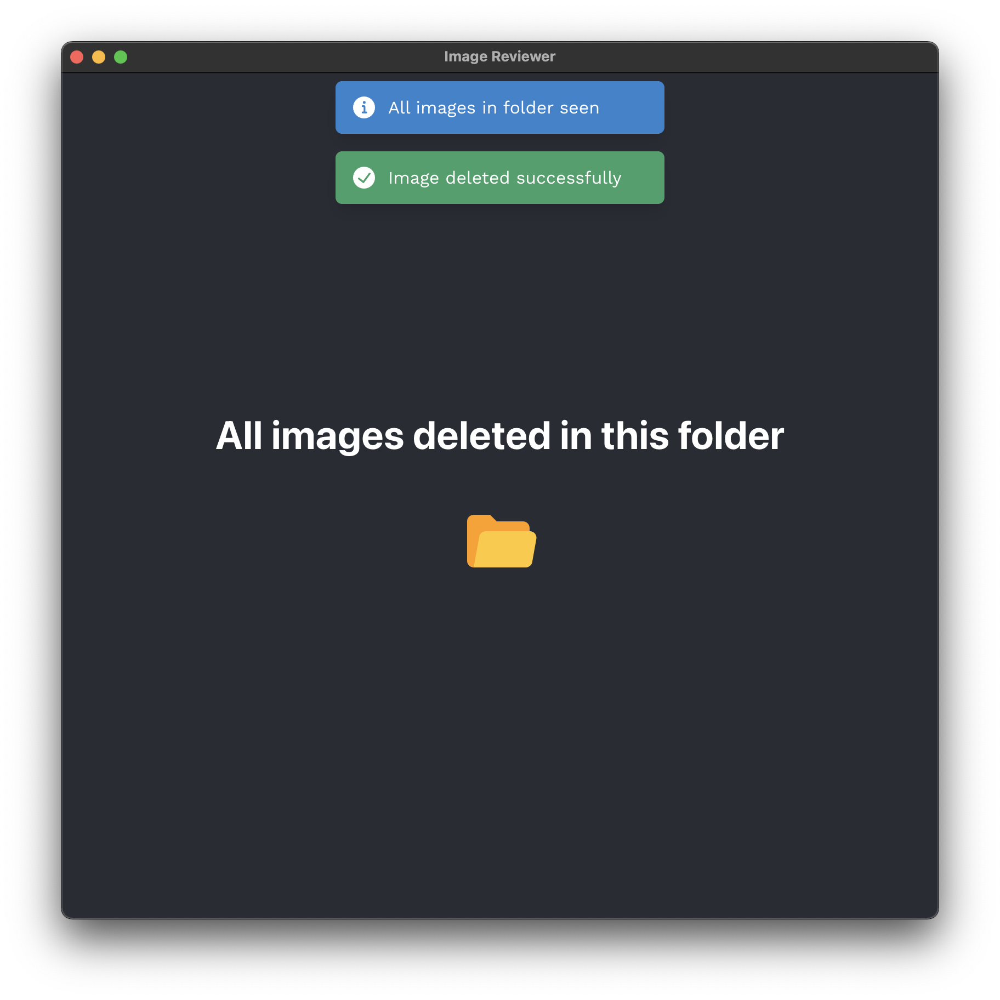

# Image Reviewer GUI



## Installation

```
> yarn install
```

## Build

Choose the right command based on your operating system:

```
> yarn build:mac | yarn build:windows | yarn build:linux
```

The resultant launch file can be found in the `dist` folder, e.g. on mac it's `dist/mac/ImageReviewer.app`. You can move this anywhere like to your desktop and run it as a standalone app going forward.

## Development

To run the dev server:

```
> yarn start
```

## Files

- Electron backend - `public/*`
- React frontend - `src/*`

## Usage

- <kbd>→</kbd> next image
- <kbd>←</kbd> prev image
- <kbd>Space</kbd> delete image
