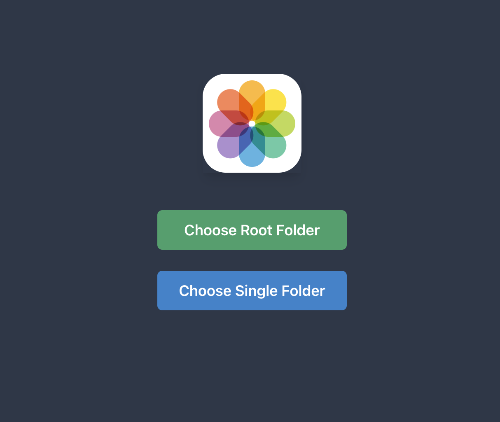

<h1 align="center">Image Classification Dataset Prepper</h1>

<div align="center">
  <svg xmlns="http://www.w3.org/2000/svg" width="120" height="120">
    <g fill="none" fill-rule="evenodd">
      <rect width="120" height="120" fill="#FFF" rx="28" />
      <g transform="translate(7 8)">
        <rect
          width="32"
          height="49"
          x="37"
          y="56"
          fill="#58B3E4"
          rx="16"
          style="mix-blend-mode: multiply"
        />
        <rect
          width="32"
          height="49"
          x="9"
          y="28"
          fill="#E084AE"
          rx="16"
          style="mix-blend-mode: multiply"
          transform="rotate(90 25 52.5)"
        />
        <rect
          width="32"
          height="49"
          x="37"
          fill="#FFB92E"
          rx="16"
          style="mix-blend-mode: multiply"
        />
        <rect
          width="32"
          height="49"
          x="65"
          y="28"
          fill="#BEDB4D"
          rx="16"
          style="mix-blend-mode: multiply"
          transform="rotate(90 81 52.5)"
        />
        <rect
          width="32"
          height="49"
          x="16.638"
          y="48.138"
          fill="#AE8ED0"
          rx="16"
          style="mix-blend-mode: multiply"
          transform="rotate(45 32.638 72.638)"
        />
        <rect
          width="32"
          height="49"
          x="56.638"
          y="8.138"
          fill="#FEE302"
          rx="16"
          style="mix-blend-mode: multiply"
          transform="rotate(45 72.638 32.638)"
        />
        <rect
          width="32"
          height="49"
          x="16.638"
          y="8.138"
          fill="#FA8554"
          rx="16"
          style="mix-blend-mode: multiply"
          transform="scale(-1 1) rotate(45 0 -46.157)"
        />
        <rect
          width="32"
          height="49"
          x="56.638"
          y="48.138"
          fill="#60CBA5"
          rx="16"
          style="mix-blend-mode: multiply"
          transform="scale(-1 1) rotate(45 0 -102.725)"
        />
      </g>
    </g>
  </svg>
</div>


When prepping data sets for training image classification models it's a real pain to manually sift through thousands of images to weed out the inaccurate, duplicate and broken ones. This app aims to make the process a lttle more tolerable by allowing you to use keyboard shortcuts to quicky cycle through all the images in a folder and delete the ones you don't want.

## Installation

First install the dependencies:

```
> yarn install or npm install
```

then build the executable:

```
> yarn package or npm run package
```

The resultant launch file can be found in the `release/build/*` folder e.g. on a mac it's `release/build/mac/ImageReviewer.app`. You can move this anywhere like to your desktop and run it as a standalone app going forward.

## Development

```
> yarn start or npm start
```

This will spin up a dev server which auto-reloads on file changes.

## Files

- Electron backend - `src/main/*`
- React frontend - `src/renderer/*`

## Usage

- <kbd>→</kbd> - next image
- <kbd>←</kbd> - prev image
- <kbd>Space</kbd> - delete image
- <kbd>CMD</kbd> / <kbd>CTRL</kbd> + <kbd>Z</kbd> - undo delete
- <kbd>CMD</kbd> / <kbd>CTRL</kbd> + <kbd>R</kbd> - refresh the app
- click the "&#x21bb;" icon on the top right of the screen to reset history (visited folders appear at a lower opacity for tracking purposes)
- &#9835; pop noise sounds each time a full loop occurs when cycling a directory

## Folder structure

<div align="center">
  
</div>

1. Click the first button if your folder structure looks like this:

```
dog-images/
- doberman/
  - a.jpg
  - b.png
- german-shepherd/
  - c.jpg
  - d.webp
- minature-poodle/
  - e.png
  - f.jpg
- etc...
```

In other words if you have a root folder with subfolders for each _class_, and inside those folders are your images.

2. Click the second button if you just want to browse a single folder full of images

## Credits

- [IOS Camera Icon](https://iconscout.com/icon/photos-30) by Giulio Smedile
- [Electron React Boilterplate](https://github.com/electron-react-boilerplate/electron-react-boilerplate)
